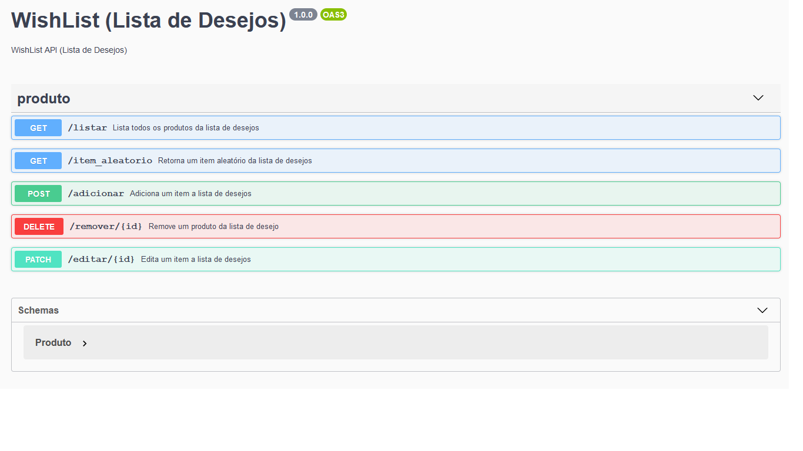

# wishlist (Lista de desejos)
> Este projeto conciste em uma API para gerir uma lista de desejos. A API foi criada em Python3.7.3 utilizando o microframework Flask e banco de dados PostgreSQL. 

## Pré-requisitos

- [Instalar Docker] (https://docs.docker.com/install/)
- (opcional) [Instalar docker-compose] (https://docs.docker.com/compose/install/)

## Executando o aplicativo através do docker

Para construir e executar o contêiner Docker com docker-compose utilize o comando:

```bash
docker-compose up --build -d
```

## Executando o aplicativo de forma local

- Instale Python3.7.3
- Instale as seguintes dependências, usando `pip install -r requirements.txt` (ou pip3 em vez de pip)

Onde requirements.txt é:

```text
flask==1.0.2
flask-sqlalchemy==2.3.0
psycopg2==2.7.6.1
```

```bash
virtualenv .venv
source .venv/bin/activate
pip install -r requirements.txt
flask run
```

## Exemplo de uso

Podemos enviar solicitações HTTP para o servidor Flask em `localhost:5000`, para testar a aplicação podemos usar um cliente REST como Postman ou Insomnia, ou podemos usar cURL no cli.

```bash
curl -XPOST -H "Content-type: application / json" -d \
'{"titulo": "livro", "descricao": "livro de python"}' \
'localhost:5000/adicionar'
```

## Métodos disponiveis na aplicação



## Documentação da API

- [Documentação](https://denis0791.github.io/)

## Apêndice

- [Postman](https://www.getpostman.com/)
- [Insomnia](https://insomnia.rest/)
